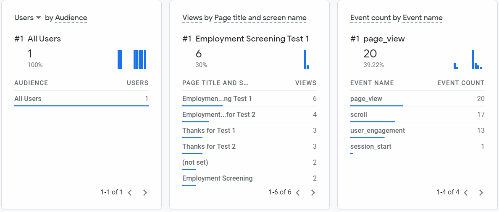

# <a href="https://github.com/rhildred/split-test" target="_blank">Midterm for Emerging Interfaces</a>

An engine for splitting the traffic between sites.

The following screenshot shows Google Analytics tracking page views:
# 